```mermaid
flowchart TB
    subgraph upstream["Dependants (2)"]
        P1["<b>⚙️&nbsp;EditSF.csproj</b><br/><small>net48</small>"]
        P4["<b>⚙️&nbsp;EsfControl.csproj</b><br/><small>net48</small>"]
        click P1 "#editsfeditsfcsproj"
        click P4 "#esfcontrolesfcontrolcsproj"
    end
    subgraph current["CommonDialogs.csproj"]
        MAIN["<b>⚙️&nbsp;CommonDialogs.csproj</b><br/><small>net48</small>"]
        click MAIN "#commondialogscommondialogscsproj"
    end
    P1 --> MAIN
    P4 --> MAIN

```

```mermaid
flowchart TB
    subgraph current["EditSF.csproj"]
        MAIN["<b>⚙️&nbsp;EditSF.csproj</b><br/><small>net48</small>"]
        click MAIN "#editsfeditsfcsproj"
    end
    subgraph downstream["Dependencies (4"]
        P4["<b>⚙️&nbsp;EsfControl.csproj</b><br/><small>net48</small>"]
        P2["<b>⚙️&nbsp;EsfLibrary.csproj</b><br/><small>net48</small>"]
        P3["<b>⚙️&nbsp;7Zip.csproj</b><br/><small>net48</small>"]
        P5["<b>⚙️&nbsp;CommonDialogs.csproj</b><br/><small>net48</small>"]
        click P4 "#esfcontrolesfcontrolcsproj"
        click P2 "#esflibraryesflibrarycsproj"
        click P3 "#library7zip7zipcsproj"
        click P5 "#commondialogscommondialogscsproj"
    end
    MAIN --> P4
    MAIN --> P2
    MAIN --> P3
    MAIN --> P5

```

```mermaid
flowchart TB
    subgraph upstream["Dependants (1)"]
        P1["<b>⚙️&nbsp;EditSF.csproj</b><br/><small>net48</small>"]
        click P1 "#editsfeditsfcsproj"
    end
    subgraph current["EsfControl.csproj"]
        MAIN["<b>⚙️&nbsp;EsfControl.csproj</b><br/><small>net48</small>"]
        click MAIN "#esfcontrolesfcontrolcsproj"
    end
    subgraph downstream["Dependencies (2"]
        P2["<b>⚙️&nbsp;EsfLibrary.csproj</b><br/><small>net48</small>"]
        P5["<b>⚙️&nbsp;CommonDialogs.csproj</b><br/><small>net48</small>"]
        click P2 "#esflibraryesflibrarycsproj"
        click P5 "#commondialogscommondialogscsproj"
    end
    P1 --> MAIN
    MAIN --> P2
    MAIN --> P5

```

```mermaid
flowchart TB
    subgraph upstream["Dependants (3)"]
        P1["<b>⚙️&nbsp;EditSF.csproj</b><br/><small>net48</small>"]
        P4["<b>⚙️&nbsp;EsfControl.csproj</b><br/><small>net48</small>"]
        P6["<b>⚙️&nbsp;EsfTest.csproj</b><br/><small>net48</small>"]
        click P1 "#editsfeditsfcsproj"
        click P4 "#esfcontrolesfcontrolcsproj"
        click P6 "#esftestesftestcsproj"
    end
    subgraph current["EsfLibrary.csproj"]
        MAIN["<b>⚙️&nbsp;EsfLibrary.csproj</b><br/><small>net48</small>"]
        click MAIN "#esflibraryesflibrarycsproj"
    end
    subgraph downstream["Dependencies (1"]
        P3["<b>⚙️&nbsp;7Zip.csproj</b><br/><small>net48</small>"]
        click P3 "#library7zip7zipcsproj"
    end
    P1 --> MAIN
    P4 --> MAIN
    P6 --> MAIN
    MAIN --> P3

```

```mermaid
flowchart TB
    subgraph current["EsfTest.csproj"]
        MAIN["<b>⚙️&nbsp;EsfTest.csproj</b><br/><small>net48</small>"]
        click MAIN "#esftestesftestcsproj"
    end
    subgraph downstream["Dependencies (1"]
        P2["<b>⚙️&nbsp;EsfLibrary.csproj</b><br/><small>net48</small>"]
        click P2 "#esflibraryesflibrarycsproj"
    end
    MAIN --> P2

```

```mermaid
flowchart TB
    subgraph upstream["Dependants (2)"]
        P1["<b>⚙️&nbsp;EditSF.csproj</b><br/><small>net48</small>"]
        P2["<b>⚙️&nbsp;EsfLibrary.csproj</b><br/><small>net48</small>"]
        click P1 "#editsfeditsfcsproj"
        click P2 "#esflibraryesflibrarycsproj"
    end
    subgraph current["7Zip.csproj"]
        MAIN["<b>⚙️&nbsp;7Zip.csproj</b><br/><small>net48</small>"]
        click MAIN "#library7zip7zipcsproj"
    end
    P1 --> MAIN
    P2 --> MAIN

```

# Projects and dependencies analysis

This document provides a comprehensive overview of the projects and their dependencies in the context of upgrading to .NETCoreApp,Version=v10.0.

## Table of Contents

- [Executive Summary](#executive-Summary)
  - [Highlevel Metrics](#highlevel-metrics)
  - [Projects Compatibility](#projects-compatibility)
  - [Package Compatibility](#package-compatibility)
  - [API Compatibility](#api-compatibility)
- [Aggregate NuGet packages details](#aggregate-nuget-packages-details)
- [Top API Migration Challenges](#top-api-migration-challenges)
  - [Technologies and Features](#technologies-and-features)
  - [Most Frequent API Issues](#most-frequent-api-issues)
- [Projects Relationship Graph](#projects-relationship-graph)
- [Project Details](#project-details)

  - [CommonDialogs\CommonDialogs.csproj](#commondialogscommondialogscsproj)
  - [EditSF\EditSF.csproj](#editsfeditsfcsproj)
  - [EsfControl\EsfControl.csproj](#esfcontrolesfcontrolcsproj)
  - [EsfLibrary\EsfLibrary.csproj](#esflibraryesflibrarycsproj)
  - [EsfTest\EsfTest.csproj](#esftestesftestcsproj)
  - [Library\7zip\7Zip.csproj](#library7zip7zipcsproj)

## Executive Summary

### Highlevel Metrics

| Metric | Count | Status |
| :--- | :---: | :--- |
| Total Projects | 6 | All require upgrade |
| Total NuGet Packages | 0 | All compatible |
| Total Code Files | 61 |  |
| Total Code Files with Incidents | 21 |  |
| Total Lines of Code | 10851 |  |
| Total Number of Issues | 2159 |  |
| Estimated LOC to modify | 2147+ | at least 19.8% of codebase |

### Projects Compatibility

| Project | Target Framework | Difficulty | Package Issues | API Issues | Est. LOC Impact | Description |
| :--- | :---: | :---: | :---: | :---: | :---: | :--- |
| [CommonDialogs\CommonDialogs.csproj](#commondialogscommondialogscsproj) | net48 | 🟡 Medium | 0 | 1149 | 1149+ | ClassicWinForms, Sdk Style = False |
| [EditSF\EditSF.csproj](#editsfeditsfcsproj) | net48 | 🟡 Medium | 0 | 520 | 520+ | ClassicWinForms, Sdk Style = False |
| [EsfControl\EsfControl.csproj](#esfcontrolesfcontrolcsproj) | net48 | 🟡 Medium | 0 | 476 | 476+ | ClassicWinForms, Sdk Style = False |
| [EsfLibrary\EsfLibrary.csproj](#esflibraryesflibrarycsproj) | net48 | 🟢 Low | 0 | 0 |  | ClassicClassLibrary, Sdk Style = False |
| [EsfTest\EsfTest.csproj](#esftestesftestcsproj) | net48 | 🟢 Low | 0 | 0 |  | ClassicDotNetApp, Sdk Style = False |
| [Library\7zip\7Zip.csproj](#library7zip7zipcsproj) | net48 | 🟢 Low | 0 | 2 | 2+ | ClassicClassLibrary, Sdk Style = False |

### Package Compatibility

| Status | Count | Percentage |
| :--- | :---: | :---: |
| ✅ Compatible | 0 | 0.0% |
| ⚠️ Incompatible | 0 | 0.0% |
| 🔄 Upgrade Recommended | 0 | 0.0% |
| ***Total NuGet Packages*** | ***0*** | ***100%*** |

### API Compatibility

| Category | Count | Impact |
| :--- | :---: | :--- |
| 🔴 Binary Incompatible | 2143 | High - Require code changes |
| 🟡 Source Incompatible | 4 | Medium - Needs re-compilation and potential conflicting API error fixing |
| 🔵 Behavioral change | 0 | Low - Behavioral changes that may require testing at runtime |
| ✅ Compatible | 7016 |  |
| ***Total APIs Analyzed*** | ***9163*** |  |

## Aggregate NuGet packages details

| Package | Current Version | Suggested Version | Projects | Description |
| :--- | :---: | :---: | :--- | :--- |

## Top API Migration Challenges

### Technologies and Features

| Technology | Issues | Percentage | Migration Path |
| :--- | :---: | :---: | :--- |
| Windows Forms | 2143 | 99.8% | Windows Forms APIs for building Windows desktop applications with traditional Forms-based UI that are available in .NET on Windows. Enable Windows Desktop support: Option 1 (Recommended): Target net9.0-windows; Option 2: Add <UseWindowsDesktop>true</UseWindowsDesktop>; Option 3 (Legacy): Use Microsoft.NET.Sdk.WindowsDesktop SDK. |
| Windows Forms Legacy Controls | 196 | 9.1% | Legacy Windows Forms controls that have been removed from .NET Core/5+ including StatusBar, DataGrid, ContextMenu, MainMenu, MenuItem, and ToolBar. These controls were replaced by more modern alternatives. Use ToolStrip, MenuStrip, ContextMenuStrip, and DataGridView instead. |
| Legacy Configuration System | 4 | 0.2% | Legacy XML-based configuration system (app.config/web.config) that has been replaced by a more flexible configuration model in .NET Core. The old system was rigid and XML-based. Migrate to Microsoft.Extensions.Configuration with JSON/environment variables; use System.Configuration.ConfigurationManager NuGet package as interim bridge if needed. |

### Most Frequent API Issues

| API | Count | Percentage | Category |
| :--- | :---: | :---: | :--- |
| T:System.Windows.Forms.Button | 207 | 9.6% | Binary Incompatible |
| T:System.Windows.Forms.ToolStripMenuItem | 158 | 7.4% | Binary Incompatible |
| T:System.Windows.Forms.AnchorStyles | 139 | 6.5% | Binary Incompatible |
| T:System.Windows.Forms.Panel | 57 | 2.7% | Binary Incompatible |
| T:System.Windows.Forms.DialogResult | 46 | 2.1% | Binary Incompatible |
| T:System.Windows.Forms.Label | 44 | 2.0% | Binary Incompatible |
| T:System.Windows.Forms.ListBox | 43 | 2.0% | Binary Incompatible |
| P:System.Windows.Forms.Control.Name | 42 | 2.0% | Binary Incompatible |
| T:System.Windows.Forms.DataGridView | 39 | 1.8% | Binary Incompatible |
| T:System.Windows.Forms.TextBox | 37 | 1.7% | Binary Incompatible |
| P:System.Windows.Forms.Control.Size | 37 | 1.7% | Binary Incompatible |
| T:System.Windows.Forms.Control.ControlCollection | 36 | 1.7% | Binary Incompatible |
| P:System.Windows.Forms.Control.Controls | 36 | 1.7% | Binary Incompatible |
| M:System.Windows.Forms.Control.ControlCollection.Add(System.Windows.Forms.Control) | 36 | 1.7% | Binary Incompatible |
| P:System.Windows.Forms.Control.TabIndex | 36 | 1.7% | Binary Incompatible |
| P:System.Windows.Forms.Control.Location | 36 | 1.7% | Binary Incompatible |
| P:System.Windows.Forms.ToolStripItem.Text | 26 | 1.2% | Binary Incompatible |
| P:System.Windows.Forms.Control.Anchor | 23 | 1.1% | Binary Incompatible |
| T:System.Windows.Forms.DataGridViewTextBoxColumn | 23 | 1.1% | Binary Incompatible |
| T:System.Windows.Forms.ToolStripProgressBar | 21 | 1.0% | Binary Incompatible |
| T:System.Windows.Forms.TreeView | 21 | 1.0% | Binary Incompatible |
| T:System.Windows.Forms.ComboBox | 19 | 0.9% | Binary Incompatible |
| F:System.Windows.Forms.AnchorStyles.Right | 18 | 0.8% | Binary Incompatible |
| P:System.Windows.Forms.ToolStripItem.Name | 18 | 0.8% | Binary Incompatible |
| T:System.Windows.Forms.SplitContainer | 18 | 0.8% | Binary Incompatible |
| F:System.Windows.Forms.AnchorStyles.Top | 17 | 0.8% | Binary Incompatible |
| P:System.Windows.Forms.ToolStripMenuItem.Enabled | 17 | 0.8% | Binary Incompatible |
| P:System.Windows.Forms.ToolStripItem.Size | 17 | 0.8% | Binary Incompatible |
| P:System.Windows.Forms.ButtonBase.UseVisualStyleBackColor | 16 | 0.7% | Binary Incompatible |
| P:System.Windows.Forms.ButtonBase.Text | 16 | 0.7% | Binary Incompatible |
| M:System.Windows.Forms.Button.#ctor | 16 | 0.7% | Binary Incompatible |
| M:System.Windows.Forms.ToolStripMenuItem.#ctor | 16 | 0.7% | Binary Incompatible |
| M:System.Windows.Forms.Control.ResumeLayout(System.Boolean) | 15 | 0.7% | Binary Incompatible |
| T:System.Windows.Forms.AutoScaleMode | 15 | 0.7% | Binary Incompatible |
| E:System.Windows.Forms.Control.Click | 15 | 0.7% | Binary Incompatible |
| M:System.Windows.Forms.Control.SuspendLayout | 15 | 0.7% | Binary Incompatible |
| T:System.Windows.Forms.ToolStripItemCollection | 15 | 0.7% | Binary Incompatible |
| T:System.Windows.Forms.MenuStrip | 15 | 0.7% | Binary Incompatible |
| T:System.Windows.Forms.TreeNodeCollection | 15 | 0.7% | Binary Incompatible |
| F:System.Windows.Forms.AnchorStyles.Bottom | 14 | 0.7% | Binary Incompatible |
| T:System.Windows.Forms.ToolStripStatusLabel | 14 | 0.7% | Binary Incompatible |
| T:System.Windows.Forms.Application | 14 | 0.7% | Binary Incompatible |
| E:System.Windows.Forms.ToolStripItem.Click | 13 | 0.6% | Binary Incompatible |
| T:System.Windows.Forms.IButtonControl | 12 | 0.6% | Binary Incompatible |
| T:System.Windows.Forms.StatusStrip | 12 | 0.6% | Binary Incompatible |
| T:System.Windows.Forms.DataGridViewRow | 12 | 0.6% | Binary Incompatible |
| T:System.Windows.Forms.TreeNode | 12 | 0.6% | Binary Incompatible |
| F:System.Windows.Forms.DialogResult.OK | 11 | 0.5% | Binary Incompatible |
| M:System.Windows.Forms.Form.Close | 10 | 0.5% | Binary Incompatible |
| M:System.Windows.Forms.Form.#ctor | 10 | 0.5% | Binary Incompatible |

## Projects Relationship Graph

Legend:
📦 SDK-style project
⚙️ Classic project

```mermaid
flowchart LR
    P1["<b>⚙️&nbsp;EditSF.csproj</b><br/><small>net48</small>"]
    P2["<b>⚙️&nbsp;EsfLibrary.csproj</b><br/><small>net48</small>"]
    P3["<b>⚙️&nbsp;7Zip.csproj</b><br/><small>net48</small>"]
    P4["<b>⚙️&nbsp;EsfControl.csproj</b><br/><small>net48</small>"]
    P5["<b>⚙️&nbsp;CommonDialogs.csproj</b><br/><small>net48</small>"]
    P6["<b>⚙️&nbsp;EsfTest.csproj</b><br/><small>net48</small>"]
    P1 --> P4
    P1 --> P2
    P1 --> P3
    P1 --> P5
    P2 --> P3
    P4 --> P2
    P4 --> P5
    P6 --> P2
    click P1 "#editsfeditsfcsproj"
    click P2 "#esflibraryesflibrarycsproj"
    click P3 "#library7zip7zipcsproj"
    click P4 "#esfcontrolesfcontrolcsproj"
    click P5 "#commondialogscommondialogscsproj"
    click P6 "#esftestesftestcsproj"

```

## Project Details

### CommonDialogs\CommonDialogs.csproj

#### Project Info

- **Current Target Framework:** net48
- **Proposed Target Framework:** net10.0-windows
- **SDK-style**: False
- **Project Kind:** ClassicWinForms
- **Dependencies**: 0
- **Dependants**: 2
- **Number of Files**: 11
- **Number of Files with Incidents**: 8
- **Lines of Code**: 934
- **Estimated LOC to modify**: 1149+ (at least 123.0% of the project)

#### Dependency Graph

Legend:
📦 SDK-style project
⚙️ Classic project

### API Compatibility

| Category | Count | Impact |
| :--- | :---: | :--- |
| 🔴 Binary Incompatible | 1149 | High - Require code changes |
| 🟡 Source Incompatible | 0 | Medium - Needs re-compilation and potential conflicting API error fixing |
| 🔵 Behavioral change | 0 | Low - Behavioral changes that may require testing at runtime |
| ✅ Compatible | 668 |  |
| ***Total APIs Analyzed*** | ***1817*** |  |

#### Project Technologies and Features

| Technology | Issues | Percentage | Migration Path |
| :--- | :---: | :---: | :--- |
| Windows Forms | 1149 | 100.0% | Windows Forms APIs for building Windows desktop applications with traditional Forms-based UI that are available in .NET on Windows. Enable Windows Desktop support: Option 1 (Recommended): Target net9.0-windows; Option 2: Add <UseWindowsDesktop>true</UseWindowsDesktop>; Option 3 (Legacy): Use Microsoft.NET.Sdk.WindowsDesktop SDK. |

### EditSF\EditSF.csproj

#### Project Info

- **Current Target Framework:** net48
- **Proposed Target Framework:** net10.0-windows
- **SDK-style**: False
- **Project Kind:** ClassicWinForms
- **Dependencies**: 4
- **Dependants**: 0
- **Number of Files**: 9
- **Number of Files with Incidents**: 6
- **Lines of Code**: 776
- **Estimated LOC to modify**: 520+ (at least 67.0% of the project)

#### Dependency Graph

Legend:
📦 SDK-style project
⚙️ Classic project

### API Compatibility

| Category | Count | Impact |
| :--- | :---: | :--- |
| 🔴 Binary Incompatible | 518 | High - Require code changes |
| 🟡 Source Incompatible | 2 | Medium - Needs re-compilation and potential conflicting API error fixing |
| 🔵 Behavioral change | 0 | Low - Behavioral changes that may require testing at runtime |
| ✅ Compatible | 576 |  |
| ***Total APIs Analyzed*** | ***1096*** |  |

#### Project Technologies and Features

| Technology | Issues | Percentage | Migration Path |
| :--- | :---: | :---: | :--- |
| Legacy Configuration System | 2 | 0.4% | Legacy XML-based configuration system (app.config/web.config) that has been replaced by a more flexible configuration model in .NET Core. The old system was rigid and XML-based. Migrate to Microsoft.Extensions.Configuration with JSON/environment variables; use System.Configuration.ConfigurationManager NuGet package as interim bridge if needed. |
| Windows Forms | 518 | 99.6% | Windows Forms APIs for building Windows desktop applications with traditional Forms-based UI that are available in .NET on Windows. Enable Windows Desktop support: Option 1 (Recommended): Target net9.0-windows; Option 2: Add <UseWindowsDesktop>true</UseWindowsDesktop>; Option 3 (Legacy): Use Microsoft.NET.Sdk.WindowsDesktop SDK. |

### EsfControl\EsfControl.csproj

#### Project Info

- **Current Target Framework:** net48
- **Proposed Target Framework:** net10.0-windows
- **SDK-style**: False
- **Project Kind:** ClassicWinForms
- **Dependencies**: 2
- **Dependants**: 1
- **Number of Files**: 4
- **Number of Files with Incidents**: 3
- **Lines of Code**: 542
- **Estimated LOC to modify**: 476+ (at least 87.8% of the project)

#### Dependency Graph

Legend:
📦 SDK-style project
⚙️ Classic project

### API Compatibility

| Category | Count | Impact |
| :--- | :---: | :--- |
| 🔴 Binary Incompatible | 476 | High - Require code changes |
| 🟡 Source Incompatible | 0 | Medium - Needs re-compilation and potential conflicting API error fixing |
| 🔵 Behavioral change | 0 | Low - Behavioral changes that may require testing at runtime |
| ✅ Compatible | 382 |  |
| ***Total APIs Analyzed*** | ***858*** |  |

#### Project Technologies and Features

| Technology | Issues | Percentage | Migration Path |
| :--- | :---: | :---: | :--- |
| Windows Forms Legacy Controls | 196 | 41.2% | Legacy Windows Forms controls that have been removed from .NET Core/5+ including StatusBar, DataGrid, ContextMenu, MainMenu, MenuItem, and ToolBar. These controls were replaced by more modern alternatives. Use ToolStrip, MenuStrip, ContextMenuStrip, and DataGridView instead. |
| Windows Forms | 476 | 100.0% | Windows Forms APIs for building Windows desktop applications with traditional Forms-based UI that are available in .NET on Windows. Enable Windows Desktop support: Option 1 (Recommended): Target net9.0-windows; Option 2: Add <UseWindowsDesktop>true</UseWindowsDesktop>; Option 3 (Legacy): Use Microsoft.NET.Sdk.WindowsDesktop SDK. |

### EsfLibrary\EsfLibrary.csproj

#### Project Info

- **Current Target Framework:** net48
- **Proposed Target Framework:** net10.0
- **SDK-style**: False
- **Project Kind:** ClassicClassLibrary
- **Dependencies**: 1
- **Dependants**: 3
- **Number of Files**: 19
- **Number of Files with Incidents**: 1
- **Lines of Code**: 3536
- **Estimated LOC to modify**: 0+ (at least 0.0% of the project)

#### Dependency Graph

Legend:
📦 SDK-style project
⚙️ Classic project

### API Compatibility

| Category | Count | Impact |
| :--- | :---: | :--- |
| 🔴 Binary Incompatible | 0 | High - Require code changes |
| 🟡 Source Incompatible | 0 | Medium - Needs re-compilation and potential conflicting API error fixing |
| 🔵 Behavioral change | 0 | Low - Behavioral changes that may require testing at runtime |
| ✅ Compatible | 2620 |  |
| ***Total APIs Analyzed*** | ***2620*** |  |

### EsfTest\EsfTest.csproj

#### Project Info

- **Current Target Framework:** net48
- **Proposed Target Framework:** net10.0
- **SDK-style**: False
- **Project Kind:** ClassicDotNetApp
- **Dependencies**: 1
- **Dependants**: 0
- **Number of Files**: 4
- **Number of Files with Incidents**: 1
- **Lines of Code**: 511
- **Estimated LOC to modify**: 0+ (at least 0.0% of the project)

#### Dependency Graph

Legend:
📦 SDK-style project
⚙️ Classic project

### API Compatibility

| Category | Count | Impact |
| :--- | :---: | :--- |
| 🔴 Binary Incompatible | 0 | High - Require code changes |
| 🟡 Source Incompatible | 0 | Medium - Needs re-compilation and potential conflicting API error fixing |
| 🔵 Behavioral change | 0 | Low - Behavioral changes that may require testing at runtime |
| ✅ Compatible | 434 |  |
| ***Total APIs Analyzed*** | ***434*** |  |

### Library\7zip\7Zip.csproj

#### Project Info

- **Current Target Framework:** net48
- **Proposed Target Framework:** net10.0
- **SDK-style**: False
- **Project Kind:** ClassicClassLibrary
- **Dependencies**: 0
- **Dependants**: 2
- **Number of Files**: 30
- **Number of Files with Incidents**: 2
- **Lines of Code**: 4552
- **Estimated LOC to modify**: 2+ (at least 0.0% of the project)

#### Dependency Graph

Legend:
📦 SDK-style project
⚙️ Classic project

### API Compatibility

| Category | Count | Impact |
| :--- | :---: | :--- |
| 🔴 Binary Incompatible | 0 | High - Require code changes |
| 🟡 Source Incompatible | 2 | Medium - Needs re-compilation and potential conflicting API error fixing |
| 🔵 Behavioral change | 0 | Low - Behavioral changes that may require testing at runtime |
| ✅ Compatible | 2336 |  |
| ***Total APIs Analyzed*** | ***2338*** |  |

#### Project Technologies and Features

| Technology | Issues | Percentage | Migration Path |
| :--- | :---: | :---: | :--- |
| Legacy Configuration System | 2 | 100.0% | Legacy XML-based configuration system (app.config/web.config) that has been replaced by a more flexible configuration model in .NET Core. The old system was rigid and XML-based. Migrate to Microsoft.Extensions.Configuration with JSON/environment variables; use System.Configuration.ConfigurationManager NuGet package as interim bridge if needed. |

